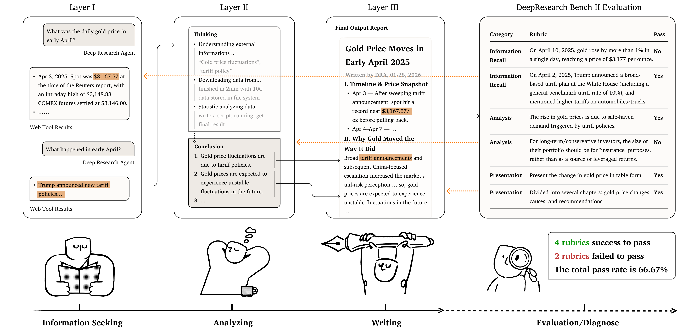
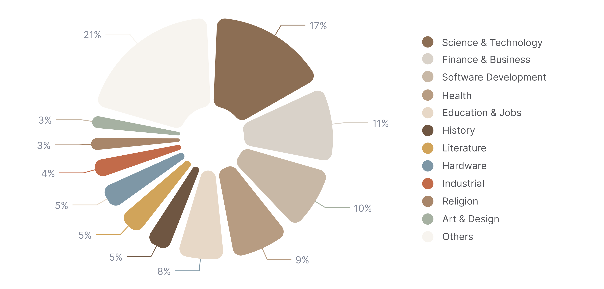
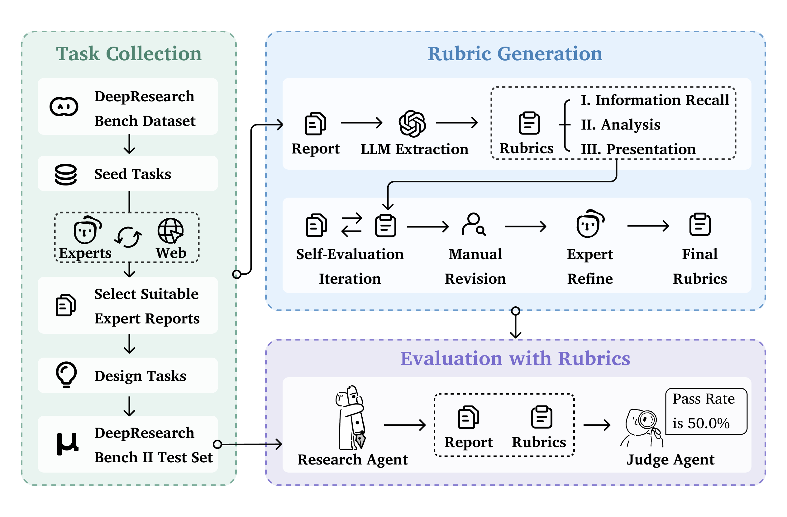

<h1 align="center">DeepResearch Bench II: Diagnosing Deep Research Agents via Rubrics from Expert Report</h1>

<div align="center">

<a href="https://agentresearchlab.org/benchmarks/deepresearch-bench-ii/index.html#home"></a>
<a href="https://agentresearchlab.org/benchmarks/deepresearch-bench-ii/index.html#leaderboard"></a>
<a href="https://arxiv.org/abs/2601.08536"></a>

</div>

<h5 align="center">
If you like our project, please give us a star ⭐ on GitHub for the latest update.
</h5>


<p align="center">
  
</p>

---

# ✨ News

+ **[Feb 2026] 🌐 Official Website & Leaderboard Released**  
  - The official [DeepResearch Bench II Website](https://agentresearchlab.org/benchmarks/deepresearch-bench-ii/index.html#home) is now live!  
  - Check out the [Leaderboard](https://agentresearchlab.org/benchmarks/deepresearch-bench-ii/index.html#leaderboard) to see how SOTA deep research agents compare across 9,430 expert-written rubrics.
  - 🎯 **Welcome to submit your model!** Contact us at imlrz@mail.ustc.edu.cn or dumingxuan@mail.ustc.edu.cn to join the leaderboard.

+ **[Jan 2026] 📄 Paper Released on arXiv**  
  - Our paper is now available on [arXiv (2601.08536)](https://arxiv.org/abs/2601.08536).

+ **[Nov 2025] 🎉 DeepResearch Bench II Evaluation Pipeline Released**  
  - This repo provides the official evaluation pipeline for **DeepResearch Bench II**, built on Gemini with fine-grained, verifiable rubrics derived from expert-written research reports.  
  - It supports **multimodal inputs** (PDF/DOCX/images/text) and **batched rubric-based evaluation** for information recall, analysis, and presentation.

For complete experimental results, model comparisons, and ablation studies, please refer to the main paper (`paper/main.pdf`).

---

## 📖 Overview

<p align="center">
  
</p>

<p align="center">
  
</p>

DeepResearch Bench II addresses key limitations of existing deep research benchmarks by combining:

- **Real-world, expert-authored research reports** as the grounding signal.
- **Fine-grained, fully verifiable rubrics** that do not rely on the judge model’s internal domain knowledge.
- **Three core dimensions** of deep research quality:
  - 🔍 **Information Recall** – Can the agent identify, retrieve, and cross-check all key information needed to answer the task?
  - 🧠 **Analysis** – Can the agent synthesize retrieved information into higher-level conclusions and insights?
  - 📝 **Presentation** – Can the agent present the information in a structured, readable, and easily verifiable way?

This repository (`DeepResearch-Bench-II`) contains a **lightweight evaluation pipeline** that:

- Takes model-generated research reports (PDF/DOCX/HTML/TXT/images),  
- Uses `tasks_and_rubrics.jsonl` to load **task descriptions and rubrics**, and  
- Invokes Gemini to **score each rubric item** in batches, producing:
  - Per-task, per-dimension rubric scores, and  
  - Aggregated CSVs summarizing model performance.

---

## Benchmark Construction

### Topic and Task Design

DeepResearch Bench II is built on top of the original **DeepResearch Bench** topic distribution and task design:

- We start from **real-world user queries** and task themes collected in the original benchmark.  
- For each seed task, we search for **expert-written review reports** addressing similar research questions in:
  - Reputable journals and top conferences,
  - High-quality institutional or governmental reports.

These source reports are:

- Written by domain experts over weeks or months,  
- Validated by reviewers, editors, and the broader community,  
- Released under **CC-BY-4.0** / **CC-BY-4.0-NC** licenses.

After license filtering and quality screening, we retain **132 expert-authored reports**, which become the basis for:

- Task formulations, and  
- Ground-truth, expert-aligned rubrics.

<p align="center">
  
</p>

### Rubric Design from Expert Articles

From each expert article, we construct:

- One or more **deep research tasks** that require both information collection and analysis.  
- A set of **binary rubrics** decomposed across the three dimensions:
  - Information Recall,
  - Analysis,
  - Presentation.

Each rubric is:

1. **Essential** – captures information necessary to correctly answer the task.  
2. **Atomic** – checks a single fact or inference; complex points are split into smaller rubrics.  
3. **Content-bearing** – encodes the actual answer, not just a vague topic (e.g., “states that X increased from A to B between years Y and Z”).  
4. **Numerically precise** – numerical rubrics explicitly specify values and tolerated error ranges.

Rubrics are built through a four-stage pipeline:

1. **LLM extraction** from expert articles, guided by carefully designed prompts.  
2. **Self-evaluation iteration** – rejecting hallucinated or inconsistent rubrics using the source article as reference.  
3. **Manual revision** – human annotators refine wording, remove redundancy, and enforce atomicity.  
4. **Expert review & refinement** – domain experts ensure that rubrics faithfully represent the article’s core content.

<p align="center">
  
</p>


---

## Evaluation Framework

DeepResearch Bench II uses **LLM-as-judge with verifiable rubrics**:

1. The **task + rubric** are serialized into a structured JSON prompt.  
2. The **model report** (PDF/DOCX/image/text) is provided as the passage (possibly as multimodal attachments).  
3. Gemini is prompted to output, for **each rubric item**:
   - `score ∈ {1, 0, -1}`,
   - `reason`, and
   - `evidence` (supporting sentences from the report).

Scoring semantics:

- `1` – rubric satisfied with valid evidence and no use of blocked references,  
- `0` – rubric not mentioned at all,  
- `-1` – rubric mentioned but evidence relies on explicitly blocked references.

The evaluation pipeline in this repo:

- Handles **multimodal inputs**:
  - PDFs are uploaded as binary attachments.
  - DOCX files are parsed into text + tables (Markdown) + extracted images.
  - Images (PNG/JPEG/WebP/GIF/BMP/TIFF) are attached as inline data.
  - TXT/MD/HTML are loaded as plain text.
- Supports **batched evaluation**:
  - Rubric items are split into batches of size `CHUNK_SIZE` (default 50).
  - Each batch is evaluated independently; results are merged and re-grouped by dimension.
- Aggregates **token usage statistics**:
  - Per batch (`usageMetadata`),  
  - Per file, and  
  - Per model across the whole run.

---

## 📊 Evaluation Results

This repository focuses on the **evaluation pipeline**.  
Aggregated scores (per-task, per-dimension, and per-model) can be produced locally via `aggregate_scores.py`.

For full experimental details, including:

- Cross-model comparison,  
- Dimension-wise analysis,  
- Error cases and ablations,

please refer to the paper (`paper/main.pdf`) and any public leaderboard associated with DeepResearch Bench II.

---

## 🛠️ Installation and Usage

### Prerequisites

- Python **3.9+**
- A Gemini-compatible API endpoint and token

---

### 1. Environment configuration (`.env`)

Create a `.env` file in the project root `DeepResearch-Bench-II` to store API configuration and runtime parameters:

```bash
cd DeepResearch-Bench-II
touch .env
vim .env  # or use your favorite editor
```

**Required config** (replace with your own values):

```bash
GEMINI_API_URL=https://your-api-endpoint.com/v1/chat/completions
GEMINI_API_TOKEN=your-api-token
GEMINI_MODEL=gemini-2.5-pro
GEMINI_REQUEST_ID=eval-request-id

PDF_DIR=report
OUT_JSONL=result.jsonl
TASKS_JSONL=tasks_and_rubrics.jsonl
CHUNK_SIZE=50
MAX_WORKERS=10
MAX_RETRIES=5
MAX_PAPER_CHARS=150000
LOG_FILE=run_evaluation.log
```

---

### 2. Install dependencies (supports `uv` / conda)

#### Option A: Use `uv` (recommended)

The project ships with `pyproject.toml`, so you can manage the virtual environment and dependencies via `uv`:

```bash
# Install uv (if not installed)
curl -LsSf https://astral.sh/uv/install.sh | sh

# Create/sync virtual environment and install dependencies
cd DeepResearch-Bench-II
uv sync
```

##### How to check whether `uv` is installed correctly

Run any of the following commands in your terminal:

```bash
# 1. Check version (recommended)
uv --version

# 2. Check executable path
which uv

# 3. Show help
uv --help
```

- If `uv --version` prints something like `uv 0.x.y`, it is installed correctly.
- If you see `command not found` or similar, `uv` is not installed or not on your `PATH`.

#### Option B: Use `conda`

```bash
# Create and activate a conda environment
conda create -n drbench-II python=3.10 -y
conda activate drbench-II

# Install Python dependencies
cd DeepResearch-Bench-II
pip install requests python-docx
```

You can then run all commands inside this conda environment.

---

### 3. Run evaluation

#### Run via `uv` (recommended)

```bash
cd DeepResearch-Bench-II
uv run python run_evaluation.py
```

#### Run directly with `python`

```bash
cd DeepResearch-Bench-II

# Use configuration from .env
python run_evaluation.py

# Or override configuration via CLI arguments
python run_evaluation.py \
    --pdf_dir grok \
    --out_jsonl result.jsonl \
    --chunk_size 50
```

---

## Project Structure

```text
DeepResearch-Bench-II/
├── assets/                    # Images and figures for README
│   ├── distribution.png
│   ├── intro.png
│   ├── main_result.png
│   └── method.png
├── report/                    # Input directory for model-generated reports
│   └── <model_name>/         # Per-model subdirectories
│       ├── idx-1.pdf         # Model output for task 1
│       ├── idx-2.docx        # Model output for task 2
│       └── ...
├── gemini_client.py           # Gemini API client (handles API calls and multimodal input)
├── run_evaluation.py          # Main evaluation script (batched rubric scoring logic)
├── aggregate_scores.py        # Score aggregation utility (produces CSV summaries)
├── tasks_and_rubrics.jsonl    # Tasks and rubrics (132 expert-derived tasks)
├── pyproject.toml             # Dependency management (uv / pip / conda)
├── .env_example               # Example configuration file
├── .env                       # Local configuration (user-created, ignored by Git)
├── .gitignore                 # Git ignore rules
└── README.md                  # This documentation
```

> **Note**: Place your model-generated reports under `report/<model_name>/idx-*.pdf|docx|html|md|txt|...`.  
> The subdirectory name becomes the model identifier in output files.

---

## Quick Start

### 1. Prepare your model outputs

Organize your model-generated reports under `PDF_DIR` (default `grok`) with the following structure:

```text
PDF_DIR/
├── ModelA/
│   ├── idx-1.pdf
│   ├── idx-2.pdf
│   └── ...
└── ModelB/
    ├── idx-1.pdf
    ├── idx-2.pdf
    └── ...
```

- Subdirectory name = **model name** (used in output JSONL).  
- File name pattern = `idx-<task_idx>.<ext>` where `<ext>` can be `pdf`, `docx`, `html`, `md`, `txt`, or an image type.

### 2. Run the evaluator

```bash
python run_evaluation.py \
  --pdf_dir report \
  --out_jsonl result.jsonl \
  --chunk_size 50 \
  --max_workers 10
```

This produces a JSONL file where each line has the form:

```json
{"model": "ModelA", "idx": 1, "result": {...}}
```

### 3. Aggregate scores

After you have a merged JSONL of evaluation results (e.g., `merged.jsonl`), run:

```bash
python aggregate_scores.py \
  --input merged.jsonl \
  --output-prefix analysis/agg_scores \
  --tasks-file tasks_and_rubrics.jsonl
```

This will generate multiple CSVs:

- `agg_scores_inforecall.csv`
- `agg_scores_analysis.csv`
- `agg_scores_presentation.csv`
- `agg_scores_total.csv`
- `agg_scores_blocked.csv`

Each CSV summarizes model performance by task (`idx`), including:

- Per-dimension scores,  
- Overall averages,  
- Blocked-rate statistics.

---

## Output Format

Evaluation results are stored as JSON Lines (`.jsonl`):

```jsonl
{"model": "model_name", "idx": 1, "result": {...}}
{"model": "model_name", "idx": 2, "result": {...}}
```

For each line:

- `model`: model identifier (derived from the subdirectory name under `PDF_DIR`)  
- `idx`: task index (parsed from the file name, e.g., `idx-1.pdf`)  
- `result`: a dict with:
  - `task`: task description
  - `scores`: rubric scores grouped by dimensions:
    - `info_recall`
    - `analysis`
    - `presentation`
  - `usage_summary`: aggregated token usage across all batches
  - `usage_metadata_per_batch`: raw `usageMetadata` for each batch

The helper script `aggregate_scores.py` can then produce CSV summaries from a merged JSONL.

---

## Acknowledgements

DeepResearch Bench II builds on the ideas and infrastructure of **DeepResearch Bench** and related benchmarks.  
We thank all authors and annotators involved in collecting tasks, source articles, and rubrics.

---

## Citation

If you use DeepResearch Bench II or this evaluation pipeline in your research, please cite:

```bibtex
@misc{li2026deepresearchbenchiidiagnosing,
      title={DeepResearch Bench II: Diagnosing Deep Research Agents via Rubrics from Expert Report}, 
      author={Ruizhe Li and Mingxuan Du and Benfeng Xu and Chiwei Zhu and Xiaorui Wang and Zhendong Mao},
      year={2026},
      eprint={2601.08536},
      archivePrefix={arXiv},
      url={https://arxiv.org/abs/2601.08536}, 
}
```


